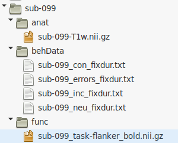
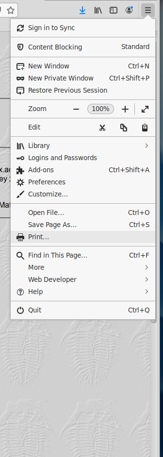
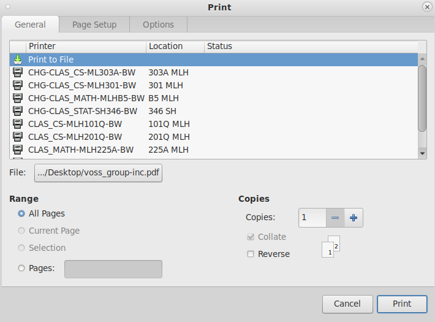

In this practical exam, you are expected to:
* [ ]  Download sub-099's T1 and flanker data to your bids directory
* [ ]  Complete single-subject processing on sub-099
* [ ]  Add sub-099 to the group analysis
* [ ]  Locate the group activation map for the incongruent>baseline and incongruent>neutral comparisons. Save these html reports as a PDF, and submit on ICON for your technical exam output.

**Access FastX** through the remote login:  
https://fastx.divms.uiowa.edu:3443/   
 

**Download data**: 
*  move to the bids directory in the terminal by typing `cd ~/fmriLab/data/bids`
*  copy/paste the following to download the data: `wget -O practicalExam.tar.gz https://osf.io/4j3du/download`
*  unpack the download by copy/pasting this in your terminal: `tar -xvf practicalExam.tar.gz`
*  type `ls` and you should now see you have a new sub-099 in your folder
*  the contents of this folder include the T1w image in anat folder, onset timing files for each trial type in behData, and the bold T2* weighted image in the func folder:  

 

**You are now ready to complete single-subject processing on sub-099. Notes & tips:**
*  The optimized `bet` settings we ran in class for 001 and 002 should work well for this subject.
*  **There were NO outlier volumes for subject 099, so you do NOT need to add an additional outlier EV!** 
*  Set up your task model in the same way we did in class.
*  It is very important that the order of the task conditions as they're entered into the `Full Model Setup` is the same as other subjects. 
*  As with previous subjects, please put your **output** into `derivatives`
*  Name your group output as `group_n4.gfeat`

**Save the html report output to a PDF file**:  
*  Once you have the group activation output for the incongruent condition open in your browser, click on the firefox menu button on the top-right of the browser window:  

*  Then click on the top left button that says `Print...` to select `Print to file` as shown below:  

 

* Finally, click on the button that says `File:` and specify your desktop as the output location and name the file as `lastname_group-inc.pdf`. Put your last name in place of `lastname` as shown in the example for `voss` above.

* Follow the same directions for the inc>neu contrast and save that PDF as `lastname_group-incGneu.pdf`.

* Load these .pdf files to icon under the technical exam assignment.

All done!
