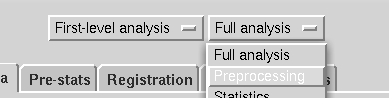
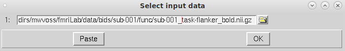
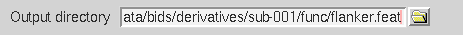
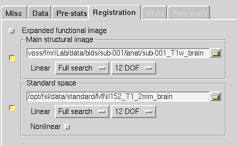
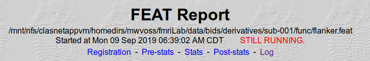

**By the end of this practical you should be able to complete preprocessing on your data with the following steps:**  
* [ ] use FSL's [bet](https://fsl.fmrib.ox.ac.uk/fsl/fslwiki/BET/UserGuide) tool to remove the brain from a T1 image  
* [ ] use FSLeyes to check the output of `bet`   
* [ ] open FSL's FEAT GUI  
* [ ] use the FEAT GUI to preprocess our functional MRI data  
* [ ] locate and check FSL's preprocessing report  
 

**Access FastX** through the remote login:  
https://fastx.divms.uiowa.edu:3443/   
 

**Download behavioral and reconstructed imaging data**, download the data we collected:  
*  Open your terminal by clicking on the icon showing a little black screen
*  Type `pwd`. Where are you in the computer filesystem?
*  Type `ls`. What other files are here? 
*  Go into the folder you made previously by typing `cd fmriLab`
*  Copy/paste `wget -O flanker-data.tar.gz https://osf.io/gk2cy/download`
*  Use commands introduced previously to see what was downloaded
*  To unpack the download copy/paste `tar -xvf flanker-data.tar.gz`
*  Move yourself into the folder with data by typing `cd data`
   *  You should see two directories named `behData` and `bids`
   *  Navigate to these within your file browser and let's talk about what these are...
 

**Prepare a folder to hold output for each subject:**  
*  Move to the bids directory in the terminal by typing `cd ~/fmriLab/data/bids`
*  Check that you're in the right place, type `ls` and you should see folders named `derivatives`,`sub-001`, and `sub-002`
   *  `derivatives` is a folder for output of structural and functional analyses
   *  protects the raw data from being over-written 
*  Make new derivatives folders for sub-001:
   *  type `mkdir -p derivatives/sub-001/anat`
   *  type `mkdir -p derivatives/sub-001/func`
 

**Prepare the T1 for functional analysis by stripping away the skull**:  
*  Also known as `brain extraction` or `skull-stripping`
*  In the terminal, move yourself to where your data are
   *  Type `cd bids`
   *  What's here? Type `ls`
*  We will use FSL's `bet` tool (**b**rain **e**xtraction **t**ool) to strip away skull
   *  Type `fsl`
   *  Click this button: 
* Suggested `bet` settings**:  
   *  File paths for input and output images, note you should change `username` below to your hawkid!
        *  Input image: `/mnt/nfs/clasnetappvm/homedirs/username/fmriLab/data/bids/sub-001/anat/sub-001_T1w.nii.gz`
        *  Output image: `/mnt/nfs/clasnetappvm/homedirs/username/fmriLab/data/bids/derivatives/sub-001/anat/sub-001_T1w.nii.gz`
   *  Set `fractional intensity threshold` to .4
   *  Use drop-down menu for `bet` pre-baked settings to select `Robust brain centre estimation (iterates bet2 several times)`
   *  Select `Output binary brain mask image` (should appear yellow box when selected)
   *  Click `Go`
   *  Progress is shown in the terminal

 

**Check the results of `bet`**:  
*  Use `fsleyes` to open the T1 image with skull and overlay the skull-stripped image and mask we just made that end with `_brain.nii.gz` and `_brain_mask.nii.gz`
*  Set image type of mask to `3D/4D mask image` 
*  Change the color of the overlay for the skull-stripped image to yellow
*  Reduce the opacity of the overlay so you can see brain/non-brain boundaries
*  Let's evaluate together...
   *  Any brain tissue missing?
   *  Anything counted as brain that shouldn't be?

 

**Open the FEAT GUI:** 
*  If FSL menu still open, let's move to the `FEAT FMRI analysis` menu
*  If FSL menu closed, in terminal type `fsl` and click on `FEAT FMRI analysis`

**Define scope of `First-level analysis` to `Preprocessing` at the top of the GUI:**
  

 
 

**Data tab in FEAT GUI:** 
*  on the `Data` tab, click `Select 4D data` and select sub-001's fMRI flanker data: 
  

*  then choose output directory: click on the folder icon, navigate to sub-001's func folder, click `OK`, then specify the location by typing `flanker.feat` in the `Data` tab like so:  

 

**Pre-stats tab in FEAT GUI:** 
*  Keep MCFLIRT on with the default reference volume
*  Keep slice-timing as `None` here
*  Keep BET brain extraction on for the functional data (yellow box means 'on')
*  Set spatial smoothing to 6 mm
*  Keep the highpass filter on 
 

**Registration tab in FEAT GUI:** 
*  Select `Main structural image` to open that window
*  Setup yours as shown below, with your `T1w_brain` image as the main structural image, and change search options to `Full search` and `12 DOF`  

**When you've set registration, click `Go`**  

An html file should pop up in your browser, showing a log of the analyses progress. As it's running let's locate and talk through the output.  

 
 

**Your technical assignment in class Thursday will be to repeat ALL these steps to preprocess sub-002's data**  