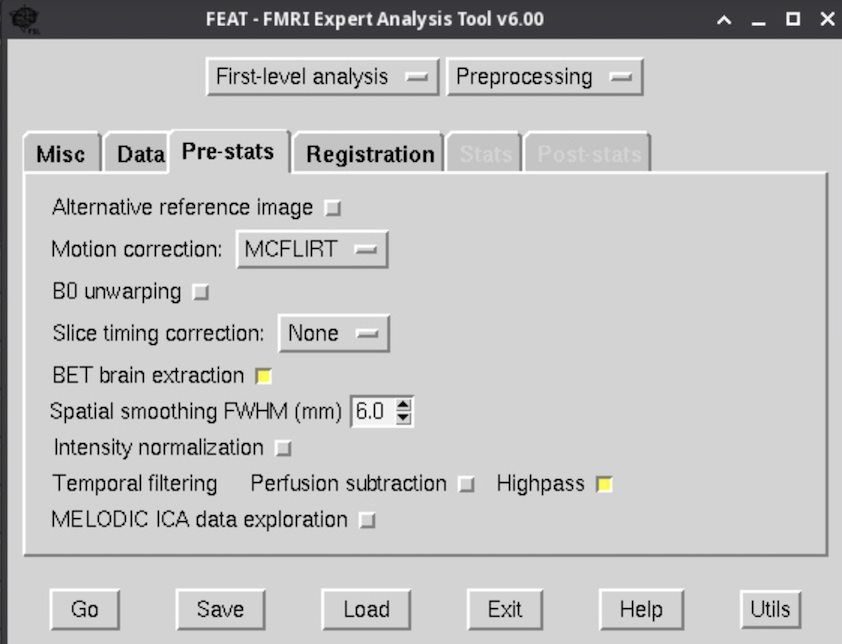
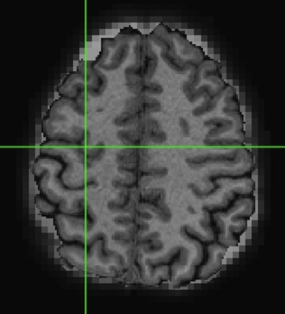
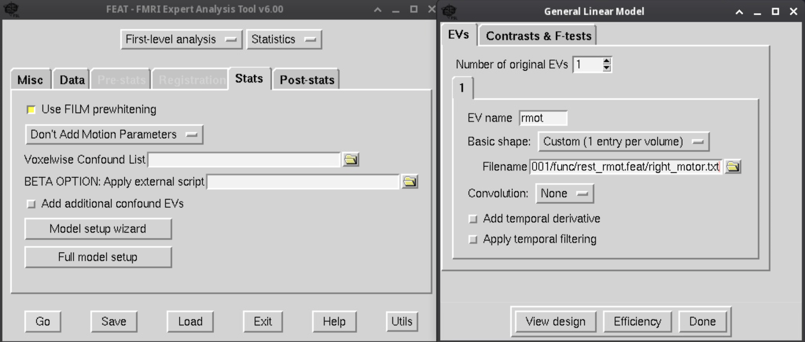
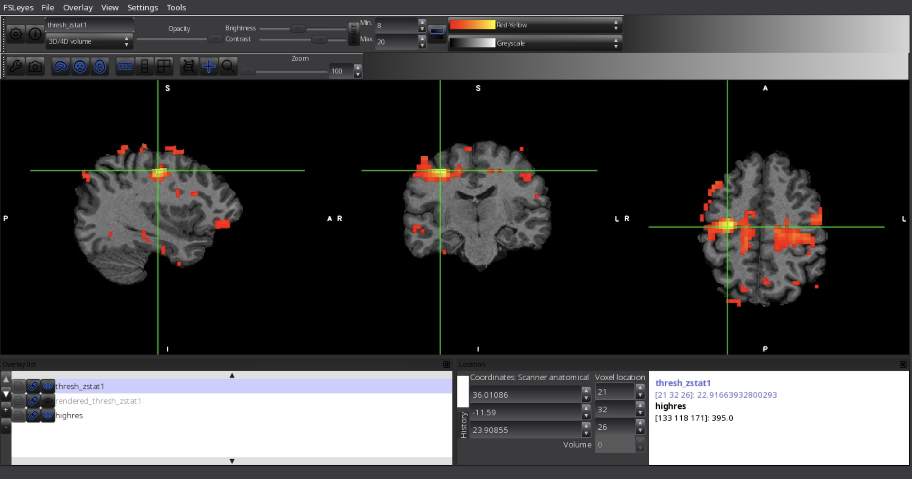

# Hands on Practical for Resting-state Functional Connectivity

For this hands on lab practice, we will be using data from sub-001 that you downloaded and processed for the previous block. \

They should be located at `$HOME/fmriLab/data/`, and you should be able to navigate to it by doing `cd ~/fmriLab/data`.   \

You should also have the "skull-striped T1 image" saved under `$HOME/fmriLab/data/bids/derivatives/sub-001/anat/` \

If not, please follow the instructions and redo the steps described here: https://github.com/mwvoss/PSY4025/blob/master/practical_preprocessing-bet-and-feat.md

## What you will learn from this lab practice
- How to replicate this famous finding from Biswal 1995 \

- Understand how to preprocess fMRI data for resting-state functional connectivity analysis
- Understand how to extract and input a "seed" timeseries to search for brain regions that show resting-state connectivity with this "seed" region of interest.

## Step 1, preprocess resting-state fMRI data
We will use the steps you learned from last block to preprocess the resting-state data.

- First, use the skills you learned from the last block, open up `sub-001-task-rest_bold.nii.gz` with fsleyes and look at the data. Data should be located at `~/fmriLab/data/bids/sub-001/func`
    - Click on `View` and select `Timeseries`
    - This is the raw timeseries data 

- Let's use FEAT again to set up preprocessing
    - Go to the subject folder and launch FSL\
        `cd ~/fmriLab/data/bids/sub-001/func`\
        `fsl`
    - In FSL GUI, open 'FEAT FMRI analysis'
        - Define scope of 'First-level analysis' to 'Preprocessing' at the top of the GUI
        - Select `sub-001-task-rest_bold.nii.gz` as input 4D. 
        - Set output to `~/fmriLab/data/bids/derivatives/sub-001/func/rest.feat`
        - We will delete the first 4 volumes in `Delete volumes`
        - Leave the High pass filter cutoff (s) to 100s
    

    - Go to the Pre-stats tab. We will do the following preprocessing
        - Motion correction with `MCFLIRT`
        - Select `BET`
        - Spatial smoothing of 6 mm
        - select `Highpass`
    

    - Go to the Registration tab, do the following:
        - Select `Main Structural Image`
        - Select the "brain extracted" T1 as the main structural image (remember this is in the derivatives folder!)
        - Change to normal search and 12 DOF
        - For standard space, change to normal search and 12 DOF 
    

- Hit Go!

- We then need to manually do "low-pass" filter. That is because FEAT does not support it (only does highpass). We have to do it via command line in the terminal.
  - Now open the terminal, move to the `rest.feat` folder you just made: `cd ~/fmriLab/data/bids/derivatives/sub-001/func/rest.feat`
  - Note, this might not work if you didn't save rest.feat under sub-001, in that case you have to find our where you saved it.
  - Then run this command:
`fslmaths filtered_func_data.nii.gz -bptf -1 2.5 filtered_func_data.nii.gz`
- Here we are doing lowpass filtering of 0.08 hz. 
    - the `-bptf` option expects a high-pass sigma and a low-pass sigma, which can be caluclated by
    - `highpass_sigma = 1 / (2 * TR * HP_freq)` (we use "-1" because we already highpassed the data)
    - `lowpass_sigma = 1 / (2 * TR * LP_freq))` (remember TR is 2s)
    - Use fsleys to look at how the low-pass filter changes the timeseries

## Step 2. Extract the seed time-series
- Stay in the preprocessed output folder `~/fmriLab/data/bids/derivatives/sub-001/func/rest.feat/`
- Use fsleyes to open up the preprocessed structural image
  - `file`, `add from file`, goto `reg`, select `highres`
- Add the `filtered_func_data`, use it as underlay (place as a layer underneath the highres). Use the skills you learned from the previous section to play around with opacity and color. Make sure they are nicely aligned.
- Let us navigate to the right motor cortex. At the location tab in the bottom, enter the following x y z coordinate for scanner anatomical space: \
x=34 (top row), y=-12 (middle row), z=24 (lower row)
- In the Overlay list panel, select filtered_func_data image, write down the "voxel location" coordinates which should be  21 32 26

- We will now create an ROI mask around that coordinate. In the terminal (still in `rest.feat`), do
  - `fslmaths filtered_func_data.nii.gz -mul 0 -add 1 -roi 21 1 32 1 26 1 0 1 right_motor -odt float`
  - `fslmaths right_motor.nii.gz -kernel sphere 5 -fmean right_motor -odt float`
  - Use the skills your learned and check the anatomical location of right_motor.nii.gz file that you just created.

- Extract time-series from right_motor from the low-pass filetered data, do: \
`fslmeants -i filtered_func_data.nii.gz -o right_motor.txt -m right_motor.nii.gz`

## Step 3. Run the functional connectivity analysis using FEAT. Inputing the seed time-series as the regressor

- In the terminal, move to where your `rest.feat` output is, do: `cd ~/fmriLab/data/bids/derivatives/sub-001/func/`
- Start `fsl`, open `FEAT`
- Change `Full analysis` to `Statistics`
- Click Input is a FEAT directory, and select the `rest.feat` folder as input.
- Click Stats tab. Keep `Don't add Motion Parameters` 

- Click Full model setup
  - In EV name, enter "right motor"
  - Change `Basic shape` to `Custom (1 entry per volume)`
  - In Filename, click the folder icon and select `right_motor.txt`
  - Change `Convolution` to `None`, and unclick Add temporal derivative and Apply temporal filtering
  

- View the design, what is this? 
- Close the design image and Hit Go!
- Inspect progress in the FEAT report html page.
- In the terminal, launch `fsleyes again`, we will load both the `reg/highres` and the `rendered_thresh_zstat1.nii.gz` images.
- After loading the `rendered_thresh_zstat1`, we can change both the colorbar and the min threshold to examine regions that show strong functional connectivity with our right motor seed.
